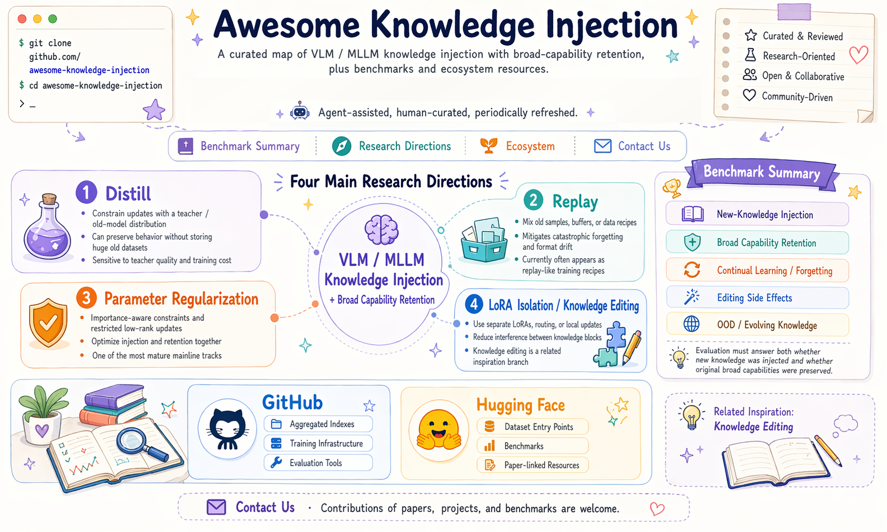

# Awesome Knowledge Injection

  <strong>English</strong> | <a href="./README.zh-CN.md">简体中文</a>

  
  
  
  
  
  

  

> A curated map centered on VLM / MLLM knowledge injection with broad-capability retention, plus related inspirations such as knowledge editing and public industry routes.

<strong>Agent-assisted, human-curated, periodically refreshed.</strong>

## 🧩 Task Introduction

This awesome targets the following business / research problem: after a VLM / MLLM already has strong general capability, how can we inject new domain knowledge, factual knowledge, task knowledge, or multimodal knowledge while preserving the model's original broad capability as much as possible?

Typical scenarios include:

- The model needs to absorb evolving knowledge such as news events, enterprise knowledge bases, vertical-domain knowledge, and multimodal facts.
- The model should keep its original visual understanding, QA, OCR, reasoning, instruction-following, and safety behavior after knowledge updates.
- Updating the model should not require full retraining every time; practical routes include SFT, distillation, PEFT, LoRA, replay, parameter regularization, and knowledge editing.
- Evaluation should cover not only new-knowledge correctness, but also broad capability retention, old-knowledge retention, cross-modal consistency, OOD generalization, and side effects.

Repository scope:

- The mainline focus is `VLM / MLLM knowledge injection + broad capability retention`.
- `LLM` papers are included as upstream inspirations only when their method can plausibly transfer to multimodal knowledge injection.
- Knowledge editing is included as a related inspiration branch because it is usually closer to small-scope / localized knowledge injection.
- GitHub and Hugging Face resources are included only when they have independent value; official paper repos stay attached to paper rows.

Current coverage:

| Dimension | Coverage | Notes |
| --- | --- | --- |
| Main method tracks | 4 | `Distill`, `Replay`, `Parameter Regularization`, and `LoRA Isolation` |
| Core papers | 15+ | directly focused on VLM / MLLM knowledge injection with broad-capability retention |
| Related inspirations | 2 groups | `LLM upstream methods` and `knowledge editing` |
| GitHub projects | 7+ | only integration-oriented repos and infrastructure that do not duplicate paper repos |
| Benchmarks / datasets | 8+ | public resources for knowledge injection, continual learning, and editing evaluation |

Last updated: `2026-05-13`

Maintenance note: this repository uses Agent-assisted updates. A lightweight update Agent periodically revisits arXiv, GitHub, company pages, and public benchmark pages to refresh links, stars, and candidate additions. All automated updates first go into a review-only workspace and only become canonical after human approval. See [MAINTAINER_AGENT.md](./MAINTAINER_AGENT.md).

🚧 Coming soon: we are building a companion `Project` with implementation code across different base models and baseline methods.

---

## 🧭 Table of Contents

- [📊 Benchmark Summary](#benchmark-summary)
- [🔬 Research Directions](#research-directions)
  - [Direction 1: Training Signals and Data Retention (Distill / Replay)](#direction-distill-replay)
  - [Direction 2: Constrained Parameter-Space Updates (Parameter Regularization)](#direction-parameter-regularization)
  - [Direction 3: Modular Isolation and Local Updates (LoRA Isolation / Knowledge Editing)](#direction-lora-isolation)
  - [Related Inspiration: Knowledge Editing](#knowledge-editing)
- [🌐 Ecosystem](#ecosystem)
  - [GitHub](#ecosystem-github)
  - [Hugging Face](#ecosystem-huggingface)
- [📮 Contact Us](#contact-us)

## 📊 Benchmark Summary

Benchmarks should answer two questions at the same time: `whether new knowledge was successfully injected` and `whether broad original capabilities were preserved`. Therefore, evaluation should not only measure new-knowledge QA accuracy, but also retention, cross-modal consistency, OOD phrasing, continual-update stability, and localized-edit side effects.

| Evaluation dimension | Main question | Representative entries |
| --- | --- | --- |
| New-knowledge injection | Can the model correctly answer or use new facts, domains, or tasks? | KORE-74K, EVOKE / MMEVOKE |
| Broad capability retention | Do original VQA, OCR, visual recognition, reasoning, and instruction-following abilities degrade? | MLLM-CL, UCIT, VTCTrain, VLMEvalKit |
| Continual learning / forgetting | Does catastrophic forgetting or answer-format drift emerge after repeated updates? | CoIN-ASD, MLLM-DCL, MTIL |
| Knowledge-editing side effects | Does a local factual update affect unrelated facts or cross-modal consistency? | MMKE-Bench, MC-MKE, ComprehendEdit |
| OOD / evolving knowledge | Does the model generalize under paraphrases, cross-event questions, and cross-domain settings? | EVOKE / MMEVOKE, ImageWikiQA |

### Supporting Benchmarks and Evaluation Papers

| Time | Paper | Approach | Model type | Experimental task | Primary datasets / benchmarks | GitHub | Stars | Venue | Year |
| --- | --- | --- | --- | --- | --- | --- | ---: | --- | --- |
| 2025-05 | [When Large Multimodal Models Confront Evolving Knowledge: Challenges and Explorations](https://arxiv.org/abs/2505.24449) | defines evolving multimodal knowledge through EVOKE / MMEVOKE | VLM / MLLM | multimodal knowledge updating, evolving-knowledge evaluation | EVOKE / MMEVOKE | [EVOKE-LMM/EVOKE](https://github.com/EVOKE-LMM/EVOKE) | 113 | arXiv / ICLR 2026 | 2025 |
| 2025-02 | [MMKE-Bench](https://arxiv.org/abs/2502.19870) | benchmark for diverse visual knowledge editing | VLM / MLLM | multimodal knowledge editing evaluation | MMKE-Bench | - | - | ICLR 2025 | 2025 |
| 2024-12 | [ComprehendEdit](https://arxiv.org/abs/2412.12821) | more complete multimodal editing data and evaluation framework | VLM / MLLM | comprehensive multimodal editing evaluation | ComprehendEdit | - | - | arXiv | 2024 |
| 2024-06 | [MC-MKE](https://arxiv.org/abs/2406.13219) | evaluation centered on cross-modal consistency after editing | VLM / MLLM | cross-modal consistency evaluation | MC-MKE | - | - | Findings of ACL 2025 | 2024 |

### Benchmarks and Datasets

This section keeps only data / benchmark / code entry points. Paper-level interpretation lives in the research-direction tables below.

| Name | Type | Links | Notes |
| --- | --- | --- | --- |
| EVOKE / MMEVOKE | benchmark + code + dataset | [code](https://github.com/EVOKE-LMM/EVOKE) / [dataset](https://huggingface.co/datasets/kailinjiang/MMEVOKE) | Main benchmark entry for evolving multimodal knowledge. |
| KORE-74K | dataset + code | [code](https://github.com/KORE-LMM/KORE) / [dataset](https://huggingface.co/datasets/kailinjiang/KORE-74K) | Data entry for retention-aware multimodal injection. |
| MLLM-CL | benchmark + dataset | [dataset](https://huggingface.co/datasets/MLLM-CL/MLLM-CL) | Core entry for domain-vs-ability continual-learning evaluation. |
| UCIT | dataset | [dataset](https://huggingface.co/datasets/MLLM-CL/UCIT) | Continual instruction-tuning dataset. |
| VTCTrain | dataset | [dataset](https://huggingface.co/datasets/MLLM-CL/VTCTrain) | Continual training / instruction-style task data. |
| DCL_10Percent_with_RAG | dataset | [dataset](https://huggingface.co/datasets/MLLM-CL/DCL_10Percent_with_RAG) | Connects domain continual learning with RAG-style support. |
| MMKE-Bench | benchmark data | [dataset](https://huggingface.co/datasets/kailinjiang/MMKE-Bench-dataset) | Multimodal knowledge-editing benchmark data. |
| MC-MKE | benchmark data | [dataset](https://huggingface.co/datasets/reroze/MC-MKE) | Useful when cross-modal consistency matters. |
| KnowEdit | dataset | [dataset](https://huggingface.co/datasets/zjunlp/KnowEdit) | Adjacent knowledge-editing data entry. |

## 🔬 Research Directions

The mainline of this README focuses on one target problem: `VLM / MLLM knowledge injection while preserving broad general capability`. Under a continual-learning lens, methods can be organized into four categories:

- `Distill`
- `Replay`
- `Parameter Regularization`
- `LoRA Isolation`

At the moment, the strongest direct public results for `VLM / MLLM knowledge injection + retention` are mostly concentrated in `Parameter Regularization` and `LoRA Isolation`. `Distill` and `Replay` remain important mainline directions; within `Distill`, we now have a meaningful set of direct `VLM / MLLM` papers, but many of the most mature training recipes and analyses still come from the `LLM` setting.

### Direction Overview

| Category | Core idea | Strengths | Weaknesses | Current public status |
| --- | --- | --- | --- | --- |
| `Distill` | use a teacher / old model distribution to constrain updates | does not always require storing a large old dataset; directly preserves behavior | sensitive to teacher quality and training cost; can distill wrong distributions too | direct VLM / MLLM papers now exist, but the knowledge-injection-with-retention setting is still less mature than parameter-regularization lines |
| `Replay` | mix old samples, replay buffers, or data mixtures during training | simple and often strong in practice; easy to reason about | needs stored or synthesized old data; privacy, storage, and training cost are higher | current public evidence is still more recipe- and diagnosis-like |
| `Parameter Regularization` | constrain important parameters, update directions, or low-rank spaces | lightweight, PEFT-friendly, easy to plug into existing training stacks | may under-inject if regularization is too strong; hyperparameter-sensitive | currently the strongest and densest direct public mainline |
| `LoRA Isolation` | isolate knowledge via separate LoRAs, experts, or routing paths | strong interference control; modular | higher parameter / deployment complexity; routing adds design overhead | few public representatives so far, but the direction is clear |

Except for `Distill`, tables below are sorted chronologically, newest first. In `Distill`, the table is split into `direct VLM / MLLM work` and `LLM upstream inspirations`, with newest-first ordering inside each group. `GitHub / Stars` records only public official repositories; newly added rows use snapshots verifiable around `2026-05-13`, while older rows keep their original snapshots.

### Direction 1: Training Signals and Data Retention (Distill / Replay)

#### Distill

This remains a mainline category for the target problem. To avoid turning it into a purely `LLM` branch, the table below first lists direct `VLM / MLLM` work, then `LLM` upstream inspirations.

| Time | Position | Paper | Approach | Model type | Experimental task | Primary datasets / benchmarks | GitHub | Stars | Venue | Year |
| --- | --- | --- | --- | --- | --- | --- | --- | ---: | --- | --- |
| 2026-05 | direct / Video-LLM self-distillation | [VISD: Enhancing Video Reasoning via Structured Self-Distillation](https://arxiv.org/abs/2605.06094) | uses a video-aware judge to produce structured feedback, then combines sparse rewards with token-level self-distillation through direction-magnitude decoupling | VLM / Video-LLM | video reasoning, spatio-temporal grounding, training efficiency | diverse video reasoning benchmarks | - | - | arXiv | 2026 |
| 2026-04 | direct / multimodal black-box OPD | [Beyond SFT-to-RL: Pre-alignment via Black-Box On-Policy Distillation for Multimodal RL](https://arxiv.org/abs/2604.28123) | inserts response-level black-box OPD / pre-alignment between SFT and RLVR, using MoE discriminators to separate perception and reasoning drift | VLM / MLLM | multimodal RLVR, visual grounding, reasoning retention | Qwen3-VL 4B / 8B, 1.26M public demos + 113K Gemini 3 Flash demonstrations, diverse multimodal benchmarks | [XIAO4579/PRISM](https://github.com/XIAO4579/PRISM) | 70 | arXiv | 2026 |
| 2026-03 | direct / VLM distillation | [Uncertainty-Aware Knowledge Distillation for Multimodal Large Language Models (Beta-KD)](https://arxiv.org/abs/2603.21426) | beta-distribution weighted distillation driven by teacher uncertainty | VLM / MLLM | MLLM compression, capability transfer | GQA / ScienceQA-IMG / TextVQA / POPE / MME-P / MMBench-dev | [Jingchensun/beta-kd](https://github.com/Jingchensun/beta-kd) | 3 | CVPR 2026 | 2026 |
| 2025-03 | direct / VLM distillation | [Enhancing Multi-hop Reasoning in Vision-Language Models via Self-Distillation with Multi-Prompt Ensembling](https://arxiv.org/abs/2503.01754) | multi-prompt ensembling plus self-distillation to compress stronger reasoning traces back into the student | VLM / MLLM | multi-hop visual reasoning, VQA | 5 VQA benchmarks | - | - | arXiv | 2025 |
| 2024-09 | direct / VLM continual learning | [Adapt without Forgetting: Distill Proximity from Dual Teachers in Vision-Language Models](https://www.ecva.net/papers/eccv_2024/papers_ECCV/html/7052_ECCV_2024_paper.php) | dual-teacher proximity distillation with graph modeling for new-task adaptation and zero-shot retention | VLM | continual learning, zero-shot transfer retention | MTIL + CIFAR100 / TinyImageNet | [myz-ah/AwoForget](https://github.com/myz-ah/AwoForget) | - | ECCV 2024 | 2024 |
| 2024-09 | direct / VLM continual learning | [Select and Distill: Selective Dual-Teacher Knowledge Transfer for Continual Learning on Vision-Language Models](https://www.ecva.net/papers/eccv_2024/papers_ECCV/html/7626_ECCV_2024_paper.php) | selective dual-teacher transfer that separates what should be preserved from what should adapt | VLM | continual learning, zero-shot retention | FGVCAircraft / DTD / EuroSAT / Flowers102 / Food101 / OxfordPets / StanfordCars / UCF101 / ImageNet | [chu0802/SnD](https://github.com/chu0802/SnD) | 16 | ECCV 2024 | 2024 |
| 2024-07 | direct / MLLM distillation | [LLAVADI: What Matters For Multimodal Large Language Models Distillation](https://arxiv.org/abs/2407.19409) | combined feature distillation, logit distillation, and teacher-generated data to analyze key MLLM distillation factors | VLM / MLLM | MLLM compression, instruction-following retention | CC-595K / LLaVA-665K + GQA / ScienceQA-IMG / TextVQA / POPE / MME-P / MMBench-dev | - | - | arXiv | 2024 |
| 2023-12 | direct / VLM distillation | [Visual Program Distillation](https://openaccess.thecvf.com/content/CVPR2024/html/Hao_Visual_Program_Distillation_OFDistilling_Tools_and_Programmatic_Reasoning_into_Vision-Language_CVPR_2024_paper.html) | distills LLM-generated programs and tool-use reasoning into a VLM | VLM / MLLM | compositional visual reasoning, factuality, robustness | MMBench / OK-VQA / A-OKVQA / TallyQA / POPE / Hateful Memes | - | - | CVPR 2024 | 2023 |
| 2023-10 | direct / VLM continual learning | [Multi-Domain Lifelong Visual Question Answering via Self-Critical Distillation](https://dl.acm.org/doi/10.1145/3581783.3612274) | replay-free self-critical distillation over logits and intermediate features | VLM | multi-domain lifelong VQA, forgetting mitigation | CLEVR / GQA / VizWiz / AQUA / VQA-Abstract | - | - | ACM MM 2023 | 2023 |
| 2026-04 | survey inspiration | [A Survey of On-Policy Distillation for Large Language Models](https://arxiv.org/abs/2604.00626) | OPD survey | LLM | survey rather than a single experimental task | - | - | - | arXiv | 2026 |
| 2026-04 | LLM upstream inspiration | [Rethinking On-Policy Distillation of Large Language Models: Phenomenology, Mechanism, and Recipe](https://arxiv.org/abs/2604.13016) | re-examines OPD through phenomenology, mechanism, and recipe design | LLM | mechanism analysis and training-recipe synthesis for OPD | OPD training and evaluation settings | - | - | arXiv | 2026 |
| 2026-04 | LLM upstream inspiration | [Self-Distillation as a Performance Recovery Mechanism for LLMs](https://arxiv.org/abs/2604.15794) | uses SDFT to recover performance after SFT / quantization / pruning, with CKA-based analysis of hidden-state manifold alignment | LLM | performance recovery, catastrophic-forgetting mitigation, post-compression recovery | recovery evaluations after SFT / quantization / pruning | - | - | arXiv | 2026 |
| 2026-04 | LLM upstream inspiration | [Unifying Group-Relative and Self-Distillation Policy Optimization via Sample Routing](https://arxiv.org/abs/2604.02288) | unifies GRPO and self-distillation within a sample-routing framework | LLM | verifiable reasoning, RLVR | 5 reasoning benchmarks | - | - | arXiv | 2026 |
| 2026-04 | LLM upstream inspiration | [Self-Distilled RLVR: Improving Reasoning by Reinforcement Learning via Self-Distillation](https://arxiv.org/abs/2604.03128) | injects self-distillation into RLVR to reduce rollout variance and stabilize reasoning gains | LLM | mathematical reasoning, RLVR | RLVR reasoning benchmarks | - | - | arXiv | 2026 |
| 2026-04 | LLM upstream inspiration | [SODA](https://arxiv.org/abs/2604.03873) | semi on-policy distillation for restricted-teacher settings | LLM | distillation with black-box or restricted teacher access | semi on-policy distillation benchmarks | - | - | arXiv | 2026 |
| 2026-03 | LLM upstream inspiration | [HEAL](https://arxiv.org/abs/2603.10359) | hindsight- and entropy-aware trajectory quality weighting | LLM | online distillation, generative learning | generative distillation / reasoning benchmarks | - | - | arXiv | 2026 |
| 2026-03 | LLM upstream inspiration | [Revisiting On-Policy Distillation: Empirical Failure Modes and Simple Fixes](https://arxiv.org/abs/2603.25562) | analyzes sampled-token OPD failures under long rollouts, teacher-prefix drift, and tokenizer mismatch, then proposes teacher top-K local support matching | LLM | OPD failure-mode analysis, reasoning / agent multi-task training | single-task reasoning and multi-task agent / reasoning benchmarks | - | - | arXiv | 2026 |
| 2026-01 | LLM upstream inspiration | [Self-Distilled Reasoner: On-Policy Self-Distillation for Large Language Models](https://arxiv.org/abs/2601.18734) | cold-starts chain-of-thought and then improves reasoning through iterative self-distillation | LLM | mathematical reasoning, verifiable reasoning training | AIME24 / AIME25 / HMMT25 | [siyan-zhao/OPSD](https://github.com/siyan-zhao/OPSD) | 107 | arXiv | 2026 |
| 2026-01 | LLM upstream inspiration | [Self-Distillation Enables Continual Learning](https://arxiv.org/abs/2601.19897) | privileged-context self-distillation | LLM | continual learning, domain adaptation | continual learning task sequences | - | - | arXiv | 2026 |
| 2023-06 | LLM upstream inspiration | [GKD](https://arxiv.org/abs/2306.13649) | student-generated trajectory distillation | LLM | instruction following, generative distillation | instruction data, generation evaluation | - | - | arXiv | 2023 |
| 2023-06 | LLM upstream inspiration | [MiniLLM](https://arxiv.org/abs/2306.08543) | generative reverse-KL on-policy distillation | LLM | text generation, instruction following | MT-Bench / AlpacaEval / instruction data | - | - | arXiv | 2023 |

#### Replay

This is also a mainline category, but public results currently lean more toward `data mixing / replay-like recipes` than toward a dense cluster of canonical methods.

| Time | Position | Paper | Approach | Model type | Experimental task | Primary datasets / benchmarks | GitHub | Stars | Venue | Year |
| --- | --- | --- | --- | --- | --- | --- | --- | ---: | --- | --- |
| 2026-03 | mainline-related recipe insight | [Fine-tuning MLLMs Without Forgetting Is Easier Than You Think](https://arxiv.org/abs/2603.14493) | data mixing + replay-like recipe + diagnostic forgetting analysis | VLM / MLLM | multimodal continual fine-tuning, forgetting analysis, practical recipe design | ImageNet-VQA / ImageWikiQA / LLaVA-665K / MLLM-CL | - | - | arXiv | 2026 |

### Direction 2: Constrained Parameter-Space Updates (Parameter Regularization)

This is currently one of the strongest mainline categories. The shared pattern is to optimize knowledge injection and capability retention together through update constraints, parameter importance, or constrained low-rank adaptation.

| Time | Position | Paper | Approach | Model type | Experimental task | Primary datasets / benchmarks | GitHub | Stars | Venue | Year |
| --- | --- | --- | --- | --- | --- | --- | --- | ---: | --- | --- |
| 2026-02 | mainline method | [Model-Dowser: Data-Free Importance Probing to Mitigate Catastrophic Forgetting in Multimodal Large Language Models](https://arxiv.org/abs/2602.04509) | data-free importance probing that protects high-importance parameters based on weight magnitude, input activations, and output sensitivity | VLM / MLLM | MLLM fine-tuning, catastrophic-forgetting mitigation | LLaVA / NVILA adaptation and broad-capability retention evaluations | [model-dowser/model-dowser.github.io](https://github.com/model-dowser/model-dowser.github.io) | 0 | arXiv | 2026 |
| 2026-02 | mainline method | [Spectral Imbalance Causes Forgetting in Low-Rank Continual Adaptation](https://arxiv.org/abs/2602.00722) | analyzes singular-value spectral imbalance in low-rank updates and balances update directions via constrained Stiefel-manifold optimization | VLM / MLLM | PEFT continual learning, backward / forward forgetting mitigation | UCIT / MLLM-DCL / MM-MergeBench | [haodotgu/EBLoRA](https://github.com/haodotgu/EBLoRA) | 3 | arXiv | 2026 |
| 2026-01 | mainline method | [KeepLoRA](https://openreview.net/forum?id=T3Vc5fkTzV) | residual gradient adaptation + low-rank update control | VLM / MLLM | continual learning, multi-task / VQA-style retention | MTIL / MLLM-DCL / UCIT | [MaolinLuo/KeepLoRA](https://github.com/MaolinLuo/KeepLoRA) | 51 | ICLR 2026 | 2026 |
| 2025-10 | mainline method | [KORE](https://arxiv.org/abs/2510.19316) | retention-aware augmentations + constrained updates for joint injection and preservation | VLM / MLLM | multimodal knowledge injection, capability retention | KORE-74K | [KORE-LMM/KORE](https://github.com/KORE-LMM/KORE) | 141 | arXiv | 2025 |
| 2025-05 | mainline method | [SEFE: Superficial and Essential Forgetting Eliminator for Multimodal Continual Instruction Tuning](https://arxiv.org/abs/2505.02486) | separates superficial forgetting from essential forgetting and combines ASD + RegLoRA to handle answer-style drift and true forgetting together | VLM / MLLM | multimodal continual instruction tuning, capability retention | CoIN-ASD / ScienceQA / TextVQA / ImageNet / GQA / VizWiz / Grounding / VQAv2 / OCRVQA | [jinpeng0528/SEFE](https://github.com/jinpeng0528/SEFE) | 11 | ICML 2025 | 2025 |
| 2025-03 | LLM upstream inspiration | [LoRA-Null](https://openreview.net/forum?id=1R9JgqUVBp) | null-space initialization + conservative low-rank updates; a useful reference line for preservation-oriented PEFT | LLM | retention during fine-tuning, forgetting mitigation | TriviaQA / NQ-Open / WebQuestions + general capability benchmarks | [HungerPWAY/LoRA-Null](https://github.com/HungerPWAY/LoRA-Null) | 9 | arXiv / OpenReview | 2025 |

### Direction 3: Modular Isolation and Local Updates (LoRA Isolation / Knowledge Editing)

This line reduces interference by isolating knowledge into separate LoRAs, experts, or routing paths.

| Time | Position | Paper | Approach | Model type | Experimental task | Primary datasets / benchmarks | GitHub | Stars | Venue | Year |
| --- | --- | --- | --- | --- | --- | --- | --- | ---: | --- | --- |
| 2026-03 | mainline method / MoE routing isolation | [On Token's Dilemma: Dynamic MoE with Drift-Aware Token Assignment for Continual Learning of Large Vision Language Models](https://arxiv.org/abs/2603.27481) | dynamically expands MoE and uses token-level assignment guidance to suppress routing drift | VLM / LVLM | multimodal continual instruction tuning, old-task token routing retention | multi-task LVLM continual-learning evaluation | [zhaoc5/DyMoE](https://github.com/zhaoc5/DyMoE) | 3 | arXiv | 2026 |
| 2026-02 | mainline method / MoE isolation | [Continual-NExT: A Unified Comprehension And Generation Continual Learning Framework](https://arxiv.org/abs/2602.18055) | MAGE mixes General LoRA and Expert LoRA to support continual comprehension and generation in dual-to-dual MLLMs | VLM / MLLM | unified continual learning for comprehension + generation, cross-modal knowledge transfer | Continual-NExT framework / benchmark | [ECNU-SII/Continual-NExT](https://github.com/ECNU-SII/Continual-NExT) | 232 | arXiv | 2026 |
| 2026-02 | mainline method / MoE isolation | [SAME: Stabilized Mixture-of-Experts for Multimodal Continual Instruction Tuning](https://arxiv.org/abs/2602.01990) | decomposes routing dynamics into orthogonal subspaces and constrains expert updates with curvature-aware scaling from historical input covariance | VLM / MLLM | multimodal continual instruction tuning, router-drift / expert-drift mitigation | CoIN MCIT / ScienceQA / TextVQA / ImageNet / GQA / VizWiz / Ref-REC / VQAv2 / OCR-VQA | - | - | arXiv | 2026 |
| 2026 | mainline method / LoRA structure expansion | [LoRA in LoRA: Towards Lifelong Model Editing via Integrating LoRA Dynamics in Evolving Subspace](https://ojs.aaai.org/index.php/AAAI/article/view/39082) | integrates LoRA dynamics inside an evolving subspace for lifelong editing and capability retention | VLM / MLLM | continual visual instruction tuning, model editing, capability retention | CVIT Benchmark: ScienceQA / TextVQA / Flickr30k / ImageNet / GQA / VQAv2 | - | - | AAAI 2026 | 2026 |
| 2025-06 | mainline method | [MLLM-CL](https://arxiv.org/abs/2506.05453) | MR-LoRA routing + expert decomposition across domain and ability tracks | VLM / MLLM | domain continual learning, ability continual learning | MLLM-CL / UCIT / VTCTrain / DCL | [bjzhb666/MLLM-CL](https://github.com/bjzhb666/MLLM-CL) | 64 | arXiv | 2025 |

Related engineering entry:
`[Ghy0501/MCITlib](https://github.com/Ghy0501/MCITlib)` is more of a toolkit / benchmark organization repo than a single-paper method, but it is worth tracking from the engineering side of this category.

#### Related Inspiration: Knowledge Editing

Knowledge editing is not the main problem setup of this repository. It is usually closer to `small-scope / local knowledge injection`, such as editing one fact or a small set of facts, rather than preserving broad capability under larger-scale multimodal knowledge injection. Still, it is very relevant for localized updates and side-effect control.

| Time | Paper | Approach | Model type | Experimental task | Primary datasets / benchmarks | GitHub | Stars | Venue | Year |
| --- | --- | --- | --- | --- | --- | --- | ---: | --- | --- |
| 2025-07 | [AdaEdit: Advancing Continuous Knowledge Editing For Large Language Models](https://aclanthology.org/2025.acl-long.208/) | stable update mechanism for continuous editing | LLM | continuous knowledge editing, long-horizon stability evaluation | CounterFact / zsRE / continuous edit sequences | - | - | ACL 2025 | 2025 |
| 2024 | [EasyEdit: An Easy-to-use Knowledge Editing Framework for LLMs](https://github.com/zjunlp/EasyEdit) | unified experimental framework and method integration | LLM | reproducible knowledge-editing evaluation | CounterFact / zsRE / KnowEdit and related datasets | [zjunlp/EasyEdit](https://github.com/zjunlp/EasyEdit) | 2769 | ACL 2024 | 2024 |
| 2023-10 | [Can We Edit Multimodal Large Language Models?](https://aclanthology.org/2023.emnlp-main.856/) | extends knowledge editing into multimodal models | VLM / MLLM | multimodal factual editing, image-text knowledge updates | MMEdit / multimodal editing benchmarks | - | - | EMNLP 2023 | 2023 |
| 2022-10 | [MEMIT](https://arxiv.org/abs/2210.07229) | many-fact batch editing | LLM | batch factual updating, local knowledge modification | CounterFact / zsRE | [kmeng01/memit](https://github.com/kmeng01/memit) | 544 | ICLR 2023 | 2022 |
| 2022-02 | [ROME](https://arxiv.org/abs/2202.05262) | rank-one parameter update editing | LLM | single-fact editing, knowledge localization | CounterFact / zsRE | [kmeng01/rome](https://github.com/kmeng01/rome) | 743 | NeurIPS 2022 | 2022 |
| 2021-10 | [MEND: Fast Model Editing at Scale](https://openreview.net/pdf?id=0DcZxeWfOPt) | low-rank gradient editor network | LLM | fast local knowledge editing | zsRE / CounterFact | [eric-mitchell/mend](https://github.com/eric-mitchell/mend) | 259 | ICLR 2022 | 2021 |

## 🌐 Ecosystem

### GitHub

This section avoids repeating official repos that are already attached to papers in the research directions. Repos such as `KORE / SEFE / MLLM-CL / EVOKE` stay attached to paper rows above. This section keeps only integration-oriented repositories, training infrastructure, and evaluation tooling.

GitHub stars checked on `2026-04-17`.

#### Aggregation / Integration Projects

| Project | Stars | Link | Category | Why it matters |
| --- | ---: | --- | --- | --- |
| Awesome Continual Learning of Vision-Language Models | 179 | [YuyangSunshine/Awesome-Continual-learning-of-Vision-Language-Models](https://github.com/YuyangSunshine/Awesome-Continual-learning-of-Vision-Language-Models) | neighboring awesome list | A valuable external index for VLM continual learning; new papers from it should be read, classified, and merged into the research directions instead of copied verbatim. |
| MCITlib | 78 | [Ghy0501/MCITlib](https://github.com/Ghy0501/MCITlib) | multimodal continual instruction tuning | Plays both a library and benchmark role. |

#### Training / Adaptation / Evaluation Infrastructure

| Project | Stars | Link | Category | Notes |
| --- | ---: | --- | --- | --- |
| PEFT | 20949 | [huggingface/peft](https://github.com/huggingface/peft) | PEFT infrastructure | Core infrastructure for LoRA, adapters, and low-rank updates. |
| LLaMA-Factory | 70198 | [hiyouga/LLaMA-Factory](https://github.com/hiyouga/LlamaFactory) | unified training framework | One of the most widely reused training stacks, now including broad VLM / MLLM support. |
| ms-swift | 13758 | [modelscope/ms-swift](https://github.com/modelscope/ms-swift) | training / post-training framework | Common in distillation, SFT, GRPO, and MLLM training pipelines. |
| VLMEvalKit | 4049 | [open-compass/VLMEvalKit](https://github.com/open-compass/VLMEvalKit) | evaluation framework | Very useful for retention, OOD, and broad-capability evaluation. |
| Avalanche | 2049 | [ContinualAI/avalanche](https://github.com/ContinualAI/avalanche) | continual learning toolkit | A general-purpose continual learning infrastructure repo. |

### Hugging Face

Hugging Face currently serves mainly as a dataset, benchmark, and paper-related entry layer for this topic. This repository does not maintain a generic base-model download leaderboard.

| Resource | Type | Link | Notes |
| --- | --- | --- | --- |
| MMEVOKE | dataset / benchmark | [kailinjiang/MMEVOKE](https://huggingface.co/datasets/kailinjiang/MMEVOKE) | Entry point for evolving multimodal knowledge evaluation. |
| KORE-74K | dataset | [kailinjiang/KORE-74K](https://huggingface.co/datasets/kailinjiang/KORE-74K) | Dataset entry for retention-aware knowledge injection. |
| MLLM-CL | dataset / benchmark | [MLLM-CL/MLLM-CL](https://huggingface.co/datasets/MLLM-CL/MLLM-CL) | Entry point for domain-vs-ability continual-learning evaluation. |
| UCIT | dataset | [MLLM-CL/UCIT](https://huggingface.co/datasets/MLLM-CL/UCIT) | Continual instruction-tuning data entry. |
| MMKE-Bench | dataset / benchmark | [kailinjiang/MMKE-Bench-dataset](https://huggingface.co/datasets/kailinjiang/MMKE-Bench-dataset) | Multimodal knowledge-editing evaluation data. |
| MC-MKE | dataset / benchmark | [reroze/MC-MKE](https://huggingface.co/datasets/reroze/MC-MKE) | Cross-modal consistency editing benchmark data. |

## 📮 Contact Us

If you have questions, suggestions, or would like to discuss potential collaboration, feel free to reach out:

- Yan Hong: `ruoning.hy@antgroup.com`
- Wei Li: `livie.lw@antgroup.com`
- Jun Lan: `yelan.lj@antgroup.com`
