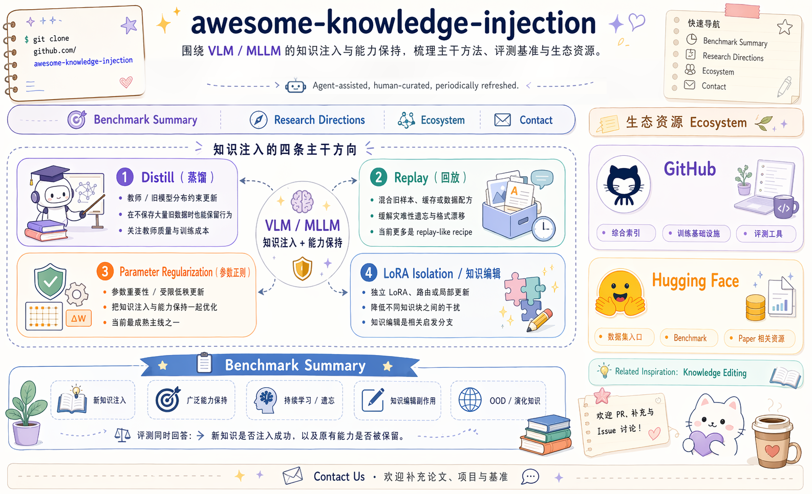

# Awesome Knowledge Injection

  <a href="./README.md">English</a> | <strong>简体中文</strong>

  
  
  
  
  
  

  

> 一个围绕 VLM / MLLM 知识注入与通用能力保持的结构化索引，并补充知识编辑与产业公开路线等相关启发。

<strong>Agent 辅助更新，人工审核，定期刷新。</strong>

## 🧩 任务介绍

这个 awesome 面向的业务 / 研究问题是：当 VLM / MLLM 已经具备较强通用能力后，如何把新的领域知识、事实知识、任务知识或多模态知识注入进去，同时尽量不损伤原有通用能力。

典型场景包括：

- 模型需要吸收持续变化的新知识，例如新闻事件、企业知识库、垂直行业知识和多模态事实。
- 模型需要在知识更新后继续保持原有视觉理解、问答、OCR、推理、指令跟随和安全行为。
- 模型更新成本受限，不能每次都重新预训练完整基座，需要依赖 SFT、蒸馏、PEFT、LoRA、数据回放、参数正则或知识编辑等机制。
- 评测不能只看新知识回答是否正确，还要同时看通用能力、旧知识保持、跨模态一致性、OOD 泛化和副作用。

本仓库的收录边界：

- 主干关注 `VLM / MLLM 知识注入 + 通用能力保持`。
- `LLM` 论文只作为上游启发项收录，除非其方法能直接迁移到多模态知识注入。
- 知识编辑作为相关启发项收录，因为它更偏小面积 / 局部知识注入。
- GitHub 与 Hugging Face 资源只收独立价值入口；论文官方代码跟随论文条目，不重复放进生态区。

当前覆盖：

| 维度 | 当前覆盖 | 说明 |
| --- | --- | --- |
| 主方法主线 | 4 类 | `Distill`、`Replay`、`Parameter Regularization`、`LoRA Isolation` |
| 主干论文 | 15+ | 直接围绕 VLM / MLLM 知识注入且强调通用能力不遗忘 |
| 相关启发 | 2 类 | `LLM 上游方法`、`知识编辑` |
| GitHub 项目 | 7+ | 只保留不与论文官方仓库重复的整合工程与基础设施 |
| 数据集 / 评测 | 8+ | 覆盖知识注入、持续学习、知识编辑相关公开基准 |

最近更新：`2026-05-13`

维护说明：这个仓库采用 Agent 辅助更新的方式。一个轻量更新 Agent 会定期回看 arXiv、GitHub、公司页面与公开 benchmark 页面，刷新链接、星标数和候选新增项；所有自动更新先进入审阅版目录，人工核验后再回写正式文件。维护协议见 [MAINTAINER_AGENT.zh-CN.md](./MAINTAINER_AGENT.zh-CN.md)。

🚧 即将推出：我们正在建设一个配套 `Project`，统一整理不同基座在不同 baseline 方案上的实现代码。

---

## 🧭 目录

- [📊 Benchmark 总结](#benchmark-summary)
- [🔬 调研研究方向](#research-directions)
  - [方向一：训练信号与数据保持（Distill / Replay）](#direction-distill-replay)
  - [方向二：参数空间受限更新（Parameter Regularization）](#direction-parameter-regularization)
  - [方向三：模块隔离与局部更新（LoRA Isolation / 知识编辑）](#direction-lora-isolation)
  - [相关启发项：知识编辑](#knowledge-editing)
- [🌐 生态](#ecosystem)
  - [GitHub](#ecosystem-github)
  - [Hugging Face](#ecosystem-huggingface)
- [📮 联系我们](#contact-us)

## 📊 Benchmark 总结

Benchmark 需要同时回答两类问题：`新知识是否注入成功`，以及 `原有通用能力是否被破坏`。因此评测不应只看新知识 QA accuracy，还应覆盖旧能力保持、跨模态一致性、OOD 问法、持续更新稳定性和局部编辑副作用。

| 评测维度 | 关注问题 | 代表入口 |
| --- | --- | --- |
| 新知识注入 | 新事实、新领域或新任务是否能被正确回答 / 使用 | KORE-74K、EVOKE / MMEVOKE |
| 通用能力保持 | 原有 VQA、OCR、视觉识别、推理、指令跟随是否下降 | MLLM-CL、UCIT、VTCTrain、VLMEvalKit |
| 持续学习 / 遗忘 | 多轮更新后是否出现灾难性遗忘或格式漂移 | CoIN-ASD、MLLM-DCL、MTIL |
| 知识编辑副作用 | 局部事实修改是否影响无关事实或跨模态一致性 | MMKE-Bench、MC-MKE、ComprehendEdit |
| OOD / 演化知识 | 换问法、跨事件、跨域场景下是否仍能泛化 | EVOKE / MMEVOKE、ImageWikiQA |

### 支撑基准与评测论文

| 时间 | 论文 | 方案 | 模型类型 | 实验任务 | 主要数据集 / 基准 | 对应 GitHub | Stars | 发表地 | 年份 |
| --- | --- | --- | --- | --- | --- | --- | ---: | --- | --- |
| 2025-05 | [When Large Multimodal Models Confront Evolving Knowledge: Challenges and Explorations](https://arxiv.org/abs/2505.24449) | 用 EVOKE / MMEVOKE 定义多模态知识持续演化问题 | VLM / MLLM | 多模态知识更新、演化知识评测 | EVOKE / MMEVOKE | [EVOKE-LMM/EVOKE](https://github.com/EVOKE-LMM/EVOKE) | 113 | arXiv / ICLR 2026 | 2025 |
| 2025-02 | [MMKE-Bench](https://arxiv.org/abs/2502.19870) | 多样视觉知识编辑基准 | VLM / MLLM | 多模态知识编辑评测 | MMKE-Bench | - | - | ICLR 2025 | 2025 |
| 2024-12 | [ComprehendEdit](https://arxiv.org/abs/2412.12821) | 更完整的多模态编辑数据与评测框架 | VLM / MLLM | 综合多模态编辑评测 | ComprehendEdit | - | - | arXiv | 2024 |
| 2024-06 | [MC-MKE](https://arxiv.org/abs/2406.13219) | 强调跨模态一致性的编辑评测 | VLM / MLLM | 跨模态一致性评测 | MC-MKE | - | - | Findings of ACL 2025 | 2024 |

### 数据集与评测基准

这里不再重复写论文摘要；下面的调研研究方向已经负责方法解读，这里只保留数据 / 基准 / 代码入口。

| 名称 | 类型 | 链接 | 说明 |
| --- | --- | --- | --- |
| EVOKE / MMEVOKE | 基准 + 代码 + 数据集 | [代码](https://github.com/EVOKE-LMM/EVOKE) / [数据集](https://huggingface.co/datasets/kailinjiang/MMEVOKE) | 对应上面的“演化知识”评测主线。 |
| KORE-74K | 数据集 + 代码 | [代码](https://github.com/KORE-LMM/KORE) / [数据集](https://huggingface.co/datasets/kailinjiang/KORE-74K) | 对应 KORE 的保留感知知识注入设置。 |
| MLLM-CL | 基准 + 数据集 | [数据集](https://huggingface.co/datasets/MLLM-CL/MLLM-CL) | 域线 / 能力线分离评测的主入口。 |
| UCIT | 数据集 | [数据集](https://huggingface.co/datasets/MLLM-CL/UCIT) | 连续指令微调数据集。 |
| VTCTrain | 数据集 | [数据集](https://huggingface.co/datasets/MLLM-CL/VTCTrain) | 持续训练与指令型任务入口。 |
| DCL_10Percent_with_RAG | 数据集 | [数据集](https://huggingface.co/datasets/MLLM-CL/DCL_10Percent_with_RAG) | 将持续领域学习与 RAG 型外部知识连接起来。 |
| MMKE-Bench | 基准数据 | [数据集](https://huggingface.co/datasets/kailinjiang/MMKE-Bench-dataset) | 多模态知识编辑基准。 |
| MC-MKE | 基准数据 | [数据集](https://huggingface.co/datasets/reroze/MC-MKE) | 跨模态一致性编辑评测。 |
| KnowEdit | 数据集 | [数据集](https://huggingface.co/datasets/zjunlp/KnowEdit) | 邻近的知识编辑数据入口。 |

## 🔬 调研研究方向

目前首页主干只关注一个问题：`VLM / MLLM 知识注入，且尽量不损伤通用能力`。如果按持续学习与抗遗忘的思路拆，可以统一归到四类：

- `Distill（蒸馏）`
- `Replay（回放 / 数据混合）`
- `Parameter Regularization（参数正则 / 受限更新）`
- `LoRA Isolation（LoRA 隔离 / 路由分治）`

其中，直接公开、且已经在 `VLM / MLLM 知识注入 + 通用能力保持` 上形成代表性结果的工作，目前主要集中在 `Parameter Regularization` 和 `LoRA Isolation`。`Distill` 与 `Replay` 仍然是主干方法方向；其中 `Distill` 这条线已经能看到一批直接相关的 `VLM / MLLM` 工作，但更成熟的训练配方和理论分析仍然大量来自 `LLM` 上游。

### 研究方向总览

| 类别 | 核心思路 | 优点 | 缺点 | 当前公开情况 |
| --- | --- | --- | --- | --- |
| `Distill（蒸馏）` | 用 teacher / old model 输出约束 student 更新 | 不一定依赖保存大量旧数据；更直接保行为 | teacher 质量和训练成本敏感；容易把错误分布一起蒸过去 | 已出现一批直接 VLM / MLLM 工作，但在“知识注入且不遗忘”设定里仍不如参数正则线成熟 |
| `Replay（回放 / 数据混合）` | 把旧样本、回放样本或数据混合一起训练 | 简单直接，通常很稳；工程上容易落地 | 需要保存或构造旧数据；隐私、存储、训练成本更高 | 当前更偏配方 / 诊断型公开结果 |
| `Parameter Regularization（参数正则 / 受限更新）` | 对重要参数、更新方向或低秩空间加约束 | 轻量、PEFT 友好、易接到现有训练框架 | 正则太强会注不进去；超参敏感；遇到大分布偏移可能不够 | 当前最强、最集中的公开主干之一 |
| `LoRA Isolation（LoRA 隔离 / 路由分治）` | 用独立 LoRA、专家或路由隔离不同知识 / 任务 | 干扰控制强；模块化清晰 | 参数和部署复杂度会上升；路由设计额外复杂 | 公开代表还不多，但方向很清晰 |

除 `Distill` 外，下表均按时间倒序（newest first）排列。`Distill` 先分成 `直接相关 VLM / MLLM 工作` 与 `LLM 上游启发` 两组，各组内部按时间倒序排列。`GitHub / Stars` 只记录公开官方仓库；新增条目以 `2026-05-13` 附近可验证快照为准，历史条目沿用原快照。`主要数据集 / 基准` 只列最核心实验入口。

### 方向一：训练信号与数据保持（Distill / Replay）

#### Distill（蒸馏）

这类方法仍然是主干候选解。为了避免把它写成“纯 LLM 方法”分支，这里先列 `VLM / MLLM` 直接工作，再列 `LLM` 上游启发。

| 时间 | 定位 | 论文 | 方案 | 模型类型 | 实验任务 | 主要数据集 / 基准 | 对应 GitHub | Stars | 发表地 | 年份 |
| --- | --- | --- | --- | --- | --- | --- | --- | ---: | --- | --- |
| 2026-05 | 直接相关 / Video-LLM 自蒸馏 | [VISD: Enhancing Video Reasoning via Structured Self-Distillation](https://arxiv.org/abs/2605.06094) | 用视频感知 judge 生成结构化反馈，并以 direction-magnitude decoupling 把稀疏奖励和 token 级自蒸馏结合起来 | VLM / Video-LLM | 视频推理、时空 grounding、训练效率 | 多类视频推理 benchmark | - | - | arXiv | 2026 |
| 2026-04 | 直接相关 / 多模态黑盒 OPD | [Beyond SFT-to-RL: Pre-alignment via Black-Box On-Policy Distillation for Multimodal RL](https://arxiv.org/abs/2604.28123) | 在 SFT 与 RLVR 之间插入 response-level 黑盒 OPD / pre-alignment，用 MoE discriminator 区分感知与推理漂移 | VLM / MLLM | 多模态 RLVR、视觉 grounding、推理保持 | Qwen3-VL 4B / 8B，1.26M public demos + 113K Gemini 3 Flash demonstrations，多种多模态 benchmark | [XIAO4579/PRISM](https://github.com/XIAO4579/PRISM) | 70 | arXiv | 2026 |
| 2026-03 | 直接相关 / VLM 蒸馏 | [Uncertainty-Aware Knowledge Distillation for Multimodal Large Language Models (Beta-KD)](https://arxiv.org/abs/2603.21426) | 基于 teacher 不确定性的 beta 分布加权蒸馏 | VLM / MLLM | MLLM 压缩、能力迁移 | GQA / ScienceQA-IMG / TextVQA / POPE / MME-P / MMBench-dev | [Jingchensun/beta-kd](https://github.com/Jingchensun/beta-kd) | 3 | CVPR 2026 | 2026 |
| 2025-03 | 直接相关 / VLM 蒸馏 | [Enhancing Multi-hop Reasoning in Vision-Language Models via Self-Distillation with Multi-Prompt Ensembling](https://arxiv.org/abs/2503.01754) | 多提示集成 + 自蒸馏，把更强推理轨迹压回学生 | VLM / MLLM | 多跳视觉推理、VQA | 5 个 VQA 基准 | - | - | arXiv | 2025 |
| 2024-09 | 直接相关 / VLM 持续学习 | [Adapt without Forgetting: Distill Proximity from Dual Teachers in Vision-Language Models](https://www.ecva.net/papers/eccv_2024/papers_ECCV/html/7052_ECCV_2024_paper.php) | 双教师 proximity distillation + 图结构建模，兼顾新任务适配与零样本保持 | VLM | 持续学习、零样本迁移保持 | MTIL + CIFAR100 / TinyImageNet | [myz-ah/AwoForget](https://github.com/myz-ah/AwoForget) | - | ECCV 2024 | 2024 |
| 2024-09 | 直接相关 / VLM 持续学习 | [Select and Distill: Selective Dual-Teacher Knowledge Transfer for Continual Learning on Vision-Language Models](https://www.ecva.net/papers/eccv_2024/papers_ECCV/html/7626_ECCV_2024_paper.php) | 选择性双教师知识迁移，区分需要保留与需要适配的知识 | VLM | 持续学习、零样本保持 | FGVCAircraft / DTD / EuroSAT / Flowers102 / Food101 / OxfordPets / StanfordCars / UCF101 / ImageNet | [chu0802/SnD](https://github.com/chu0802/SnD) | 16 | ECCV 2024 | 2024 |
| 2024-07 | 直接相关 / MLLM 蒸馏 | [LLAVADI: What Matters For Multimodal Large Language Models Distillation](https://arxiv.org/abs/2407.19409) | 联合特征蒸馏、logit 蒸馏与教师生成数据，分析 MLLM 蒸馏关键因素 | VLM / MLLM | MLLM 压缩、指令跟随保持 | CC-595K / LLaVA-665K + GQA / ScienceQA-IMG / TextVQA / POPE / MME-P / MMBench-dev | - | - | arXiv | 2024 |
| 2023-12 | 直接相关 / VLM 蒸馏 | [Visual Program Distillation](https://openaccess.thecvf.com/content/CVPR2024/html/Hao_Visual_Program_Distillation_OFDistilling_Tools_and_Programmatic_Reasoning_into_Vision-Language_CVPR_2024_paper.html) | 把 LLM 生成的程序与工具链推理蒸入 VLM | VLM / MLLM | 组合视觉推理、事实性与鲁棒性 | MMBench / OK-VQA / A-OKVQA / TallyQA / POPE / Hateful Memes | - | - | CVPR 2024 | 2023 |
| 2023-10 | 直接相关 / VLM 持续学习 | [Multi-Domain Lifelong Visual Question Answering via Self-Critical Distillation](https://dl.acm.org/doi/10.1145/3581783.3612274) | 无回放自批判蒸馏，同时约束 logits 与中间表征 | VLM | 多域终身 VQA、遗忘缓解 | CLEVR / GQA / VizWiz / AQUA / VQA-Abstract | - | - | ACM MM 2023 | 2023 |
| 2026-04 | 综述启发 | [A Survey of On-Policy Distillation for Large Language Models](https://arxiv.org/abs/2604.00626) | OPD 方法综述 | LLM | 综述，不以单一实验任务为主 | - | - | - | arXiv | 2026 |
| 2026-04 | LLM 上游启发 | [Rethinking On-Policy Distillation of Large Language Models: Phenomenology, Mechanism, and Recipe](https://arxiv.org/abs/2604.13016) | 从现象学、机制与配方三层重审 OPD | LLM | 在线蒸馏机理分析与训练配方总结 | OPD 训练与评测设置 | - | - | arXiv | 2026 |
| 2026-04 | LLM 上游启发 | [Self-Distillation as a Performance Recovery Mechanism for LLMs](https://arxiv.org/abs/2604.15794) | 用 SDFT 恢复 SFT / 量化 / 剪枝后的性能退化，并用 CKA 分析隐藏层流形对齐 | LLM | 性能恢复、灾难性遗忘缓解、压缩后恢复 | SFT / quantization / pruning 后的恢复评测 | - | - | arXiv | 2026 |
| 2026-04 | LLM 上游启发 | [Unifying Group-Relative and Self-Distillation Policy Optimization via Sample Routing](https://arxiv.org/abs/2604.02288) | 用 sample routing 把 GRPO 与 self-distillation 统一起来 | LLM | 可验证推理、RLVR | 5 个推理基准 | - | - | arXiv | 2026 |
| 2026-04 | LLM 上游启发 | [Self-Distilled RLVR: Improving Reasoning by Reinforcement Learning via Self-Distillation](https://arxiv.org/abs/2604.03128) | 在 RLVR 中加入自蒸馏，降低 rollout 方差并稳住推理提升 | LLM | 数学推理、RLVR | RLVR 推理基准 | - | - | arXiv | 2026 |
| 2026-04 | LLM 上游启发 | [SODA](https://arxiv.org/abs/2604.03873) | 半在线蒸馏，面向教师访问受限场景 | LLM | 黑盒 / 受限访问下的蒸馏 | 半在线蒸馏评测 | - | - | arXiv | 2026 |
| 2026-03 | LLM 上游启发 | [HEAL](https://arxiv.org/abs/2603.10359) | 基于事后信息与教师熵的轨迹质量加权 | LLM | 在线蒸馏、生成式学习 | 生成式蒸馏 / 推理基准 | - | - | arXiv | 2026 |
| 2026-03 | LLM 上游启发 | [Revisiting On-Policy Distillation: Empirical Failure Modes and Simple Fixes](https://arxiv.org/abs/2603.25562) | 分析 sampled-token OPD 在长 rollout、教师 prefix 偏移和 tokenizer mismatch 下的失效，并提出 teacher top-K local support matching | LLM | OPD 失效模式分析、推理 / agent 多任务训练 | 单任务推理与多任务 agent / reasoning benchmark | - | - | arXiv | 2026 |
| 2026-01 | LLM 上游启发 | [Self-Distilled Reasoner: On-Policy Self-Distillation for Large Language Models](https://arxiv.org/abs/2601.18734) | 先冷启动 CoT，再迭代自蒸馏提升推理能力 | LLM | 数学推理、可验证推理训练 | AIME24 / AIME25 / HMMT25 | [siyan-zhao/OPSD](https://github.com/siyan-zhao/OPSD) | 107 | arXiv | 2026 |
| 2026-01 | LLM 上游启发 | [Self-Distillation Enables Continual Learning](https://arxiv.org/abs/2601.19897) | 特权上下文自蒸馏 | LLM | 持续学习、领域适应 | 持续学习序列任务 | - | - | arXiv | 2026 |
| 2023-06 | LLM 上游启发 | [GKD](https://arxiv.org/abs/2306.13649) | 学生自生成轨迹蒸馏 | LLM | 指令跟随、文本生成蒸馏 | 指令数据、生成评测 | - | - | arXiv | 2023 |
| 2023-06 | LLM 上游启发 | [MiniLLM](https://arxiv.org/abs/2306.08543) | 生成式 reverse-KL 在线蒸馏 | LLM | 文本生成、指令跟随 | MT-Bench / AlpacaEval / 指令数据 | - | - | arXiv | 2023 |

#### Replay（回放 / 数据混合）

这类方法同样属于主干方法，但当前公开结果更多还是 `数据混合 / replay-like recipe`，还没有形成像参数正则那样密集的公开方法带。

| 时间 | 定位 | 论文 | 方案 | 模型类型 | 实验任务 | 主要数据集 / 基准 | 对应 GitHub | Stars | 发表地 | 年份 |
| --- | --- | --- | --- | --- | --- | --- | --- | ---: | --- | --- |
| 2026-03 | 主干相关 / 配方洞察 | [Fine-tuning MLLMs Without Forgetting Is Easier Than You Think](https://arxiv.org/abs/2603.14493) | 数据混合配方 + replay-like 训练思路 + 诊断式遗忘分析 | VLM / MLLM | 多模态持续微调、遗忘分析、实用配方总结 | ImageNet-VQA / ImageWikiQA / LLaVA-665K / MLLM-CL | - | - | arXiv | 2026 |

### 方向二：参数空间受限更新（Parameter Regularization）

这是当前最成熟、最值得优先覆盖的主干方法线之一。共同特征是：通过参数约束、重要性约束或受限低秩更新，把“知识注入”和“能力保持”一起优化。

| 时间 | 定位 | 论文 | 方案 | 模型类型 | 实验任务 | 主要数据集 / 基准 | 对应 GitHub | Stars | 发表地 | 年份 |
| --- | --- | --- | --- | --- | --- | --- | --- | ---: | --- | --- |
| 2026-02 | 主干方法 | [Model-Dowser: Data-Free Importance Probing to Mitigate Catastrophic Forgetting in Multimodal Large Language Models](https://arxiv.org/abs/2602.04509) | 数据无关重要性探测，按权重幅值、输入激活和输出敏感性保护高重要参数 | VLM / MLLM | MLLM 微调、灾难性遗忘缓解 | LLaVA / NVILA 适配实验与通用能力保持评测 | [model-dowser/model-dowser.github.io](https://github.com/model-dowser/model-dowser.github.io) | 0 | arXiv | 2026 |
| 2026-02 | 主干方法 | [Spectral Imbalance Causes Forgetting in Low-Rank Continual Adaptation](https://arxiv.org/abs/2602.00722) | 分析低秩更新奇异值谱失衡导致遗忘，并用受限 Stiefel 流形优化平衡更新方向 | VLM / MLLM | PEFT 持续学习、前向 / 后向遗忘缓解 | UCIT / MLLM-DCL / MM-MergeBench | [haodotgu/EBLoRA](https://github.com/haodotgu/EBLoRA) | 3 | arXiv | 2026 |
| 2026-01 | 主干方法 | [KeepLoRA](https://openreview.net/forum?id=T3Vc5fkTzV) | 残差梯度适应 + 低秩更新控制 | VLM / MLLM | 持续学习、多任务 / VQA 等能力保持 | MTIL / MLLM-DCL / UCIT | [MaolinLuo/KeepLoRA](https://github.com/MaolinLuo/KeepLoRA) | 51 | ICLR 2026 | 2026 |
| 2025-10 | 主干方法 | [KORE](https://arxiv.org/abs/2510.19316) | 保留感知增强 + 受限更新，把知识注入与能力保持一起建模 | VLM / MLLM | 多模态知识注入、能力保持 | KORE-74K | [KORE-LMM/KORE](https://github.com/KORE-LMM/KORE) | 141 | arXiv | 2025 |
| 2025-05 | 主干方法 | [SEFE: Superficial and Essential Forgetting Eliminator for Multimodal Continual Instruction Tuning](https://arxiv.org/abs/2505.02486) | 区分 superficial forgetting 与 essential forgetting，结合 ASD + RegLoRA 同时处理格式漂移与真实遗忘 | VLM / MLLM | 多模态持续指令微调、能力保持 | CoIN-ASD / ScienceQA / TextVQA / ImageNet / GQA / VizWiz / Grounding / VQAv2 / OCRVQA | [jinpeng0528/SEFE](https://github.com/jinpeng0528/SEFE) | 11 | ICML 2025 | 2025 |
| 2025-03 | LLM 上游启发 | [LoRA-Null](https://openreview.net/forum?id=1R9JgqUVBp) | Null-space 初始化 + 保守低秩更新，是保留型 PEFT 的典型参考线 | LLM | 微调中的知识保持、遗忘缓解 | TriviaQA / NQ-Open / WebQuestions + 通用能力基准 | [HungerPWAY/LoRA-Null](https://github.com/HungerPWAY/LoRA-Null) | 9 | arXiv / OpenReview | 2025 |

### 方向三：模块隔离与局部更新（LoRA Isolation / 知识编辑）

这条线通过 `独立 LoRA / expert / routing` 去隔离不同知识块或任务块，目标是把干扰压低到更局部的范围。

| 时间 | 定位 | 论文 | 方案 | 模型类型 | 实验任务 | 主要数据集 / 基准 | 对应 GitHub | Stars | 发表地 | 年份 |
| --- | --- | --- | --- | --- | --- | --- | --- | ---: | --- | --- |
| 2026-03 | 主干方法 / MoE 路由隔离 | [On Token's Dilemma: Dynamic MoE with Drift-Aware Token Assignment for Continual Learning of Large Vision Language Models](https://arxiv.org/abs/2603.27481) | 动态扩展 MoE，并用 token-level assignment guidance 抑制 routing drift | VLM / LVLM | 多模态持续指令微调、旧任务 token 路由保持 | 多任务 LVLM 持续学习评测 | [zhaoc5/DyMoE](https://github.com/zhaoc5/DyMoE) | 3 | arXiv | 2026 |
| 2026-02 | 主干方法 / MoE 隔离 | [Continual-NExT: A Unified Comprehension And Generation Continual Learning Framework](https://arxiv.org/abs/2602.18055) | MAGE 同时使用 General LoRA 与 Expert LoRA 的混合聚合，服务双向理解与生成 MLLM 持续学习 | VLM / MLLM | 理解 + 生成统一持续学习、跨模态知识迁移 | Continual-NExT framework / benchmark | [ECNU-SII/Continual-NExT](https://github.com/ECNU-SII/Continual-NExT) | 232 | arXiv | 2026 |
| 2026-02 | 主干方法 / MoE 隔离 | [SAME: Stabilized Mixture-of-Experts for Multimodal Continual Instruction Tuning](https://arxiv.org/abs/2602.01990) | 将 routing dynamics 分解到正交子空间，并用历史输入协方差做 curvature-aware expert 更新约束 | VLM / MLLM | 多模态持续指令微调、router drift / expert drift 缓解 | CoIN MCIT / ScienceQA / TextVQA / ImageNet / GQA / VizWiz / Ref-REC / VQAv2 / OCR-VQA | - | - | arXiv | 2026 |
| 2026 | 主干方法 / LoRA 结构扩展 | [LoRA in LoRA: Towards Lifelong Model Editing via Integrating LoRA Dynamics in Evolving Subspace](https://ojs.aaai.org/index.php/AAAI/article/view/39082) | 在演化子空间中嵌套 LoRA 动态，面向终身模型编辑与持续能力保持 | VLM / MLLM | 持续视觉指令调优、模型编辑、能力保持 | CVIT Benchmark：ScienceQA / TextVQA / Flickr30k / ImageNet / GQA / VQAv2 | - | - | AAAI 2026 | 2026 |
| 2025-06 | 主干方法 | [MLLM-CL](https://arxiv.org/abs/2506.05453) | MR-LoRA 路由 + expert 分治，把持续学习拆成领域线与能力线 | VLM / MLLM | 领域持续学习、能力持续学习 | MLLM-CL / UCIT / VTCTrain / DCL | [bjzhb666/MLLM-CL](https://github.com/bjzhb666/MLLM-CL) | 64 | arXiv | 2025 |

相关工程入口：
`[Ghy0501/MCITlib](https://github.com/Ghy0501/MCITlib)` 更偏多模态持续指令学习工具库与基准组织，不是单篇论文方法，但适合当工程侧入口。

#### 相关启发项：知识编辑

知识编辑不是这个仓库的主干问题设定。它更偏向 `小面积 / 局部知识注入`，通常关注单事实或少量事实的定点修改，而不是面向更大规模、多模态知识注入时的通用能力保持问题。但它对“如何做局部更新、如何控制副作用”仍然很有启发。

| 时间 | 论文 | 方案 | 模型类型 | 实验任务 | 主要数据集 / 基准 | 对应 GitHub | Stars | 发表地 | 年份 |
| --- | --- | --- | --- | --- | --- | --- | ---: | --- | --- |
| 2025-07 | [AdaEdit: Advancing Continuous Knowledge Editing For Large Language Models](https://aclanthology.org/2025.acl-long.208/) | 面向连续编辑的稳定更新机制 | LLM | 连续知识编辑、长期稳定性评测 | CounterFact / zsRE / 连续编辑序列 | - | - | ACL 2025 | 2025 |
| 2024 | [EasyEdit: An Easy-to-use Knowledge Editing Framework for LLMs](https://github.com/zjunlp/EasyEdit) | 统一实验框架与方法集成 | LLM | 知识编辑复现、统一评测 | CounterFact / zsRE / KnowEdit 等 | [zjunlp/EasyEdit](https://github.com/zjunlp/EasyEdit) | 2769 | ACL 2024 | 2024 |
| 2023-10 | [Can We Edit Multimodal Large Language Models?](https://aclanthology.org/2023.emnlp-main.856/) | 将知识编辑扩展到图文多模态模型 | VLM / MLLM | 多模态事实编辑、图文知识更新 | MMEdit / 图文知识编辑基准 | - | - | EMNLP 2023 | 2023 |
| 2022-10 | [MEMIT](https://arxiv.org/abs/2210.07229) | 多事实批量编辑 | LLM | 批量事实更新、局部知识修改 | CounterFact / zsRE | [kmeng01/memit](https://github.com/kmeng01/memit) | 544 | ICLR 2023 | 2022 |
| 2022-02 | [ROME](https://arxiv.org/abs/2202.05262) | 秩一参数更新编辑 | LLM | 单事实编辑、知识定位 | CounterFact / zsRE | [kmeng01/rome](https://github.com/kmeng01/rome) | 743 | NeurIPS 2022 | 2022 |
| 2021-10 | [MEND: Fast Model Editing at Scale](https://openreview.net/pdf?id=0DcZxeWfOPt) | 低秩梯度编辑器网络 | LLM | 快速局部知识编辑 | zsRE / CounterFact | [eric-mitchell/mend](https://github.com/eric-mitchell/mend) | 259 | ICLR 2022 | 2021 |

## 🌐 生态

### GitHub

这里不重复列调研研究方向里已经出现的论文官方仓库；像 `KORE / SEFE / MLLM-CL / EVOKE` 这类论文方法代码，统一挂在对应论文行里。本节只保留综合汇总类、训练基础设施和评测工具。

GitHub 星标统计日期：`2026-04-17`

#### 综合索引 / 整合工程

| 项目 | Stars | 链接 | 归类 | 为什么值得关注 |
| --- | ---: | --- | --- | --- |
| Awesome Continual Learning of Vision-Language Models | 179 | [YuyangSunshine/Awesome-Continual-learning-of-Vision-Language-Models](https://github.com/YuyangSunshine/Awesome-Continual-learning-of-Vision-Language-Models) | 论文索引 | VLM 持续学习最值得长期跟踪的外部 awesome；其中新增论文需要先读后归类，再并入调研研究方向，而不是原样抄录。 |
| MCITlib | 78 | [Ghy0501/MCITlib](https://github.com/Ghy0501/MCITlib) | 整合工程 | 更偏多模态持续指令学习工具库与基准组织，而不是单篇论文仓库。 |

#### 训练 / 适配 / 评测基础设施

| 项目 | Stars | 链接 | 归类 | 备注 |
| --- | ---: | --- | --- | --- |
| PEFT | 20949 | [huggingface/peft](https://github.com/huggingface/peft) | PEFT 基础设施 | 低秩更新、适配器、LoRA 路线的核心基础设施。 |
| LLaMA-Factory | 70198 | [hiyouga/LLaMA-Factory](https://github.com/hiyouga/LlamaFactory) | 训练整合框架 | 目前最常被复用的统一训练工程之一，VLM / MLLM 微调覆盖也很广。 |
| ms-swift | 13758 | [modelscope/ms-swift](https://github.com/modelscope/ms-swift) | 训练 / 后训练框架 | 蒸馏、SFT、GRPO、MLLM 训练都很常见。 |
| VLMEvalKit | 4049 | [open-compass/VLMEvalKit](https://github.com/open-compass/VLMEvalKit) | 评测框架 | 做能力保持、OOD 与广泛能力评测时非常常用。 |
| Avalanche | 2049 | [ContinualAI/avalanche](https://github.com/ContinualAI/avalanche) | 持续学习工具库 | 通用持续学习基础设施。 |

### Hugging Face

Hugging Face 目前主要承载数据集、benchmark 与 paper 相关入口，不维护泛模型下载榜。

| 资源 | 类型 | 链接 | 说明 |
| --- | --- | --- | --- |
| MMEVOKE | 数据集 / benchmark | [kailinjiang/MMEVOKE](https://huggingface.co/datasets/kailinjiang/MMEVOKE) | 演化多模态知识评测入口。 |
| KORE-74K | 数据集 | [kailinjiang/KORE-74K](https://huggingface.co/datasets/kailinjiang/KORE-74K) | 保留感知知识注入数据入口。 |
| MLLM-CL | 数据集 / benchmark | [MLLM-CL/MLLM-CL](https://huggingface.co/datasets/MLLM-CL/MLLM-CL) | 域线 / 能力线持续学习评测入口。 |
| UCIT | 数据集 | [MLLM-CL/UCIT](https://huggingface.co/datasets/MLLM-CL/UCIT) | 连续指令微调数据入口。 |
| MMKE-Bench | 数据集 / benchmark | [kailinjiang/MMKE-Bench-dataset](https://huggingface.co/datasets/kailinjiang/MMKE-Bench-dataset) | 多模态知识编辑评测数据。 |
| MC-MKE | 数据集 / benchmark | [reroze/MC-MKE](https://huggingface.co/datasets/reroze/MC-MKE) | 跨模态一致性编辑评测数据。 |

## 📮 联系我们

如果你有问题、建议，或者希望进一步合作交流，欢迎联系：

- Yan Hong: `ruoning.hy@antgroup.com`
- Wei Li: `livie.lw@antgroup.com`
- Jun Lan: `yelan.lj@antgroup.com`
